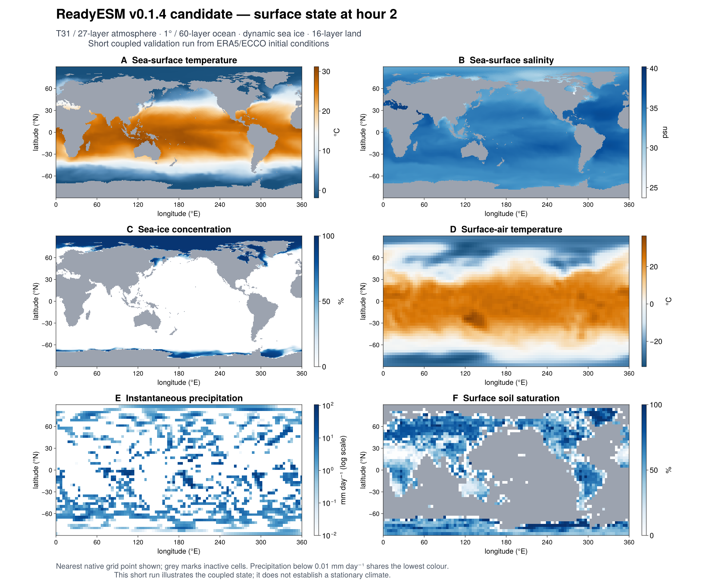

# ReadyESM

ReadyESM couples SpeedyWeather, RRTMGP, Oceananigans, ClimaSeaIce and Terrarium.
The current model is a T31/L27 atmosphere over a 1° tripolar, 60-level ocean,
with dynamic sea ice and 16-layer land. ERA5 and ECCO provide the initial state.

This is a research model under development, not a calibrated projection model.
The production configuration is [`config/production.yml`](config/production.yml).

The `v0.1.4` candidate repairs native runoff integration, tripolar runoff
delivery, precipitation diagnostics, Fourier GPU graph buffer selection and
sparse GPU exchange.
Its validation status is recorded in
[`HISTORY.md`](HISTORY.md).



*The v0.1.4 candidate at simulated hour 2, after a one-hour GPU restart check.
This is a short validation snapshot. [Figure provenance](docs/readiesm-v0.1.4-snapshot.json).*

## Run

The production configuration requires Julia 1.12 and an NVIDIA GPU with
working CUDA drivers.

```bash
julia --project=. -e 'using Pkg; Pkg.instantiate()'
python -m pip install -r scripts/requirements.txt
python scripts/download_era5_initial_state.py --include-stratosphere
julia --project=. scripts/run_dynamic_esm.jl config/production.yml
```

The ERA5 download requires CDS credentials. The January 1993 ECCO V4r4 files
download through ClimaOcean/NumericalEarth, with a public
[NumericalEarthArtifacts mirror](https://github.com/NumericalEarth/NumericalEarthArtifacts/releases/tag/data-v1)
when the primary ECCO download fails. Initial downloads require network access;
later runs reuse the cached inputs. `scripts/prepare_ecco_monthly_bundle.jl`
can verify and arrange a local monthly bundle for an explicit
`ecco_initial_conditions_directory`.

The runner validates its diagnostics and writes results under
`artifacts/production`. To make a final-day atlas:

```bash
julia --project=. scripts/plot_final_day_summary.jl \
    artifacts/production/diagnostics.nc artifacts/production/final_day.png
```

CO2 is an active prescribed concentration in RRTMGP. Sulfate aerosol can be
applied as prescribed optical depth. There is no interactive carbon cycle,
emissions-driven CO2 or aerosol chemistry yet.

See [`NOTES.md`](NOTES.md) for the present scientific limitations and
[`HISTORY.md`](HISTORY.md) for the short model history.

## Test

The CPU regression suite uses synthetic initial conditions and requires no
ERA5 credentials or GPU. After instantiating the pinned environment, run:

```bash
julia --project=. --startup-file=no test/runtests.jl
```

The Fourier graph cache and conservative regridding regressions need a CUDA
GPU but no input downloads:

```bash
julia --project=. --startup-file=no test/cuda_graph_cache.jl
julia --project=. --startup-file=no test/csr_regridding_gpu.jl
```

On a CUDA machine with the production inputs, the short coupled and restart
checks run in separate Julia processes:

```bash
julia --project=. scripts/validate_coupled_smoke.jl artifacts/release-smoke
julia --project=. scripts/validate_coupled_restart.jl \
    artifacts/release-smoke/hour1_restart.jld2 artifacts/release-restart
julia --project=. scripts/compare_dynamic_restart_boundaries.jl \
    artifacts/release-restart artifacts/release-smoke/hour1_restart.jld2 \
    artifacts/release-restart/restored_boundary.jld2
```

These checks exercise one simulated hour followed by an independently restored
hour at production resolution. They verify exact restoration of checkpointed
model state and finite continuation. They do not establish a stationary climate
or exact equality between continuous and restarted trajectories. Model
construction and the first GPU step can take hours despite the short simulated
duration.

Checkpoints made before the native-runoff repair lack pending exchange water.
Start a new run with this version; those checkpoints are rejected explicitly.
